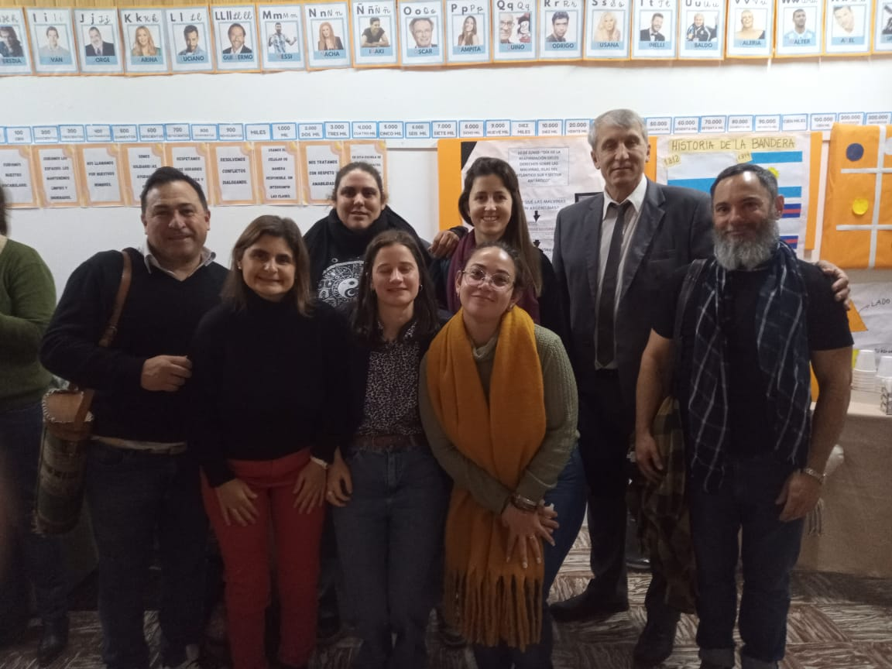

```{r setup, include=FALSE}
knitr::opts_chunk$set(echo = TRUE)
```

<style>
details > summary {
  background-color: #007BFF;
  color: white;
  padding: 10px;
  font-weight: bold;
  border: none;
  border-radius: 4px;
  cursor: pointer;
  margin-top: 10px;
}
details[open] > summary {
  background-color: #0056b3;
}
details details > summary {
  background-color: #28a745;
  color: white;
  margin-top: 8px;
}
details details[open] > summary {
  background-color: #1e7e34;
}
</style>

<style>
details > summary {
  background-color: #007BFF;
  color: white;
  padding: 10px;
  font-weight: bold;
  border: none;
  border-radius: 4px;
  cursor: pointer;
  margin-top: 10px;
}
details[open] > summary {
  background-color: #0056b3;
}
</style>

<style>
p {
  text-align: justify;
  text-indent: 30px;
  margin-bottom: 20px;
  font-size: 16px;
  line-height: 1.6;
}
</style>

<!-- Encabezado con logo y título -->
<table style="width:100%; border-collapse:collapse;">
  <tr>
    <td style="width:80%; vertical-align:middle;">
      <h1 style="margin: 0;">Mi Primer Voto</h1>
      <h4 style="margin: 0;">Lic. Daniel D. Molina - EES N°2 Rauch</h4>
      <p style="margin: 0;">12 de julio de 2025</p>
    </td>
    <td style="width:20%; text-align:right;">
      
    </td>
  </tr>
</table>

# 
<p style="text-indent: 30px; margin-bottom: 20px;">
“La democracia es el gobierno de todos y para todos. No se limita a la participación en los procesos electorales, se construye colectiva y cotidianamente en distintas esferas de la vida social. El voto es un modo de participar en ella, de elegir el rumbo y la forma que queremos para nuestra Argentina ”.<br>Prof. Alberto E. Sileoni</p>

## Mi primer voto 

<p style="text-indent: 30px; margin-bottom: 20px;">
<span style="font-weight: bold;">Por David Cela Heffel, Gastón De Luca y Sabrina Garbovetzky.</span> <br> Es un programa de formación política destinado a personas que viven en la provincia de Buenos Aires y emitirán su voto por primera vez.
El programa está pensado para informar, capacitar y formar a ciudadanos y ciudadanas de la provincia de Buenos Aires en aspectos políticos que se presentan en la vida democrática de la provincia de Buenos Aires. El mismo buscará propiciar la participación ciudadana en el ejercicio democrático.
El programa se estructura sobre las características del Estado y del Gobierno, el sistema democrático y sus formas de representación y participación, las características históricas y sociales del voto en la República Argentina y en particular en la Provincia de Buenos Aires y el ejercicio electoral en el día de los comicios.</p>

<details>
<summary><strong>Jornada</strong></summary>
<br>

<details>
<summary><strong>Presentación</strong></summary>
<p style="font-family: Verdana; font-size: 18px; color: black; text-indent: 30px; margin-bottom: 20px;">
El presente informe detalla los contenidos y alcances de la Capacitación Mi Primer Voto del día 11 de julio de 2025 en la ciudad de San Miguel del Monte.
</p>
</details>

<details>
<summary><strong>Introducción</strong></summary>
<p style="text-indent: 30px; margin-bottom: 20px;">
El día 11 de julio se llevó a cabo la Capacitación Mi Primer Voto, con el objeto de brindar a los docentes de la región herramientas para desarrollar propuestas que permitan a nuestras y nuestros estudiantes formarse como ciudadanos comprometidos con los valores democráticos a partir del ejercicio del sufragio. Reconociendo que este no es el único vínculo entre ciudadanía y ejercicio político, y mucho menos con el significado de democracia en sentido amplio.
</p>
</details>

<details>
<summary><strong>Detalle de la jornada</strong></summary>
<p style="text-indent: 30px; margin-bottom: 20px;">
El encuentro fue planteado como taller, en el cual los docentes presentes realizamos algunos ejercicios con el objetivo de reconocer algunos aspectos cruciales que deben ser considerados a la hora de diseñar proyectos para el aula referidos a este tema.
</p>
</details>

<details>
<summary><strong>Acciones</strong></summary>
<p style="text-indent: 30px; margin-bottom: 20px;">
El encuentro comenzó con un ejercicio que ponía de relieve la importancia de las redes sociales en la participación política de los jóvenes de 16 y 17 años, aunque no se ofrecieron datos que sustentaran tal supuesto. Luego, se revisaron de manera superficial y banal algunos atributos del sistema electoral bonaerense (cronogramas, desdoblamiento, renovación parcial, etc.), lo cual también se realizó más tarde con el sistema electoral nacional. Según las capacitadoras, corresponde un alto porcentaje de participación electoral a los jóvenes, sin embargo, esta idea no fue respaldada empíricamente. Por último, se propuso armar grupos por distrito escolar para coordinar acciones en conjunto.</p>
</details>

<details>
<summary><strong>Conclusiones</strong></summary>
<p style="text-indent: 30px; margin-bottom: 20px;">
A diferencia de la capacitación realizada en el año 2023, esta nueva edición no contó con la presencia de expertos, como la Mg. en Estudios Electorales Sabrina Garbovetzky, ni los datos e información necesarios para el respaldo de lo trabajado. Faltó además, la mirada de expertos en elecciones y sistemas electorales (ya que eso es lo que se trató) lo cual, empobreció una jornada que debería haberse aprovechado para estructurar las guías y orientaciones necesarias para un desarrollo serio, responsable y con base científica, sobre todo, por las implicancias y el impacto potencial que guarda para la formación de actores sociales críticos y democráticos. A pesar de las falencias detectadas, los y las docentes de Rauch pudimos coincidir en la elaboración de material audiovisual de manera compartida y colaborativa y en la posible realización de un encuentro entre estudiantes y candidatos</p>
</details>

<details>
  <summary><strong>Imágenes</strong></summary>
  <div style="display: flex; flex-wrap: wrap; gap: 10px;">
    
    
    
    
    
    
    
  </div>
</details>

</details>

<details>
<summary><strong>Normativa</strong></summary>

<details>
<summary><strong>Ley 26.774 - Ciudadanía a los 16 años</strong></summary>
<p style="text-indent: 30px; margin-bottom: 20px;">
Esta ley amplía los derechos políticos a los jóvenes desde los 16 años, habilitándolos para votar en elecciones nacionales.
<a href="https://www.argentina.gob.ar/normativa/nacional/ley-26774-197891">Ver texto completo</a>
</p>
</details>

<details>
<summary><strong>Ley de Educación Nacional 26.206</strong></summary>
<p style="text-indent: 30px; margin-bottom: 20px;">
Establece el derecho a una educación integral, de calidad y con igualdad de oportunidades para todos.
<a href="https://www.argentina.gob.ar/normativa/nacional/ley-26206-129994">Ver texto completo</a>
</p>
</details>

<details>
<summary><strong>Resolución 330/22 - Lineamientos de Educación en Ciudadanía</strong></summary>
<p style="text-indent: 30px; margin-bottom: 20px;">
Documento que promueve el desarrollo de propuestas pedagógicas que fortalezcan la formación ciudadana en las escuelas.
<a href="https://www.argentina.gob.ar/sites/default/files/resolucion_330-22.pdf">Ver texto completo</a>
</p>
</details>

<details>
<summary><strong>Diseño Curricular de Secundaria - Provincia de Buenos Aires</strong></summary>
<p style="text-indent: 30px; margin-bottom: 20px;">
Marco normativo que regula los contenidos y enfoques de enseñanza de la ciudadanía en el nivel secundario.
<a href="https://abc.gob.ar/curriculum/educacion-secundaria">Ver sitio oficial</a>
</p>
</details>

</details>

<details>
<summary><strong>Materiales</strong></summary>

<details>
<summary><strong>Guía para docentes</strong></summary>
<p style="text-indent: 30px; margin-bottom: 20px;">
Documento con orientaciones didácticas para abordar el voto joven en el aula.
<a href="https://www.argentina.gob.ar/sites/default/files/guia_docentes_voto_joven.pdf">Descargar guía</a>
</p>
</details>

<details>
<summary><strong>Material para estudiantes</strong></summary>
<p style="text-indent: 30px; margin-bottom: 20px;">
Folleto informativo sobre el voto a los 16 y el sistema electoral argentino.
<a href="https://www.argentina.gob.ar/sites/default/files/folleto_estudiantes_voto_joven.pdf">Descargar material</a>
</p>
</details>

<details>
<summary><strong>Material audiovisual</strong></summary>
<p style="text-indent: 30px; margin-bottom: 20px;">
Video educativo sobre la importancia de la participación juvenil en la democracia.
<a href="https://www.youtube.com/watch?v=Il5HQrSZhZw" target="_blank">Ver video</a>
</p>
</details>

</details>


