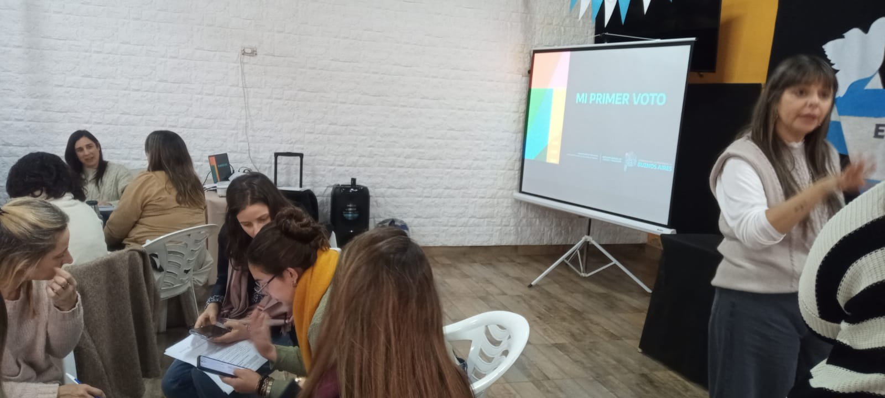
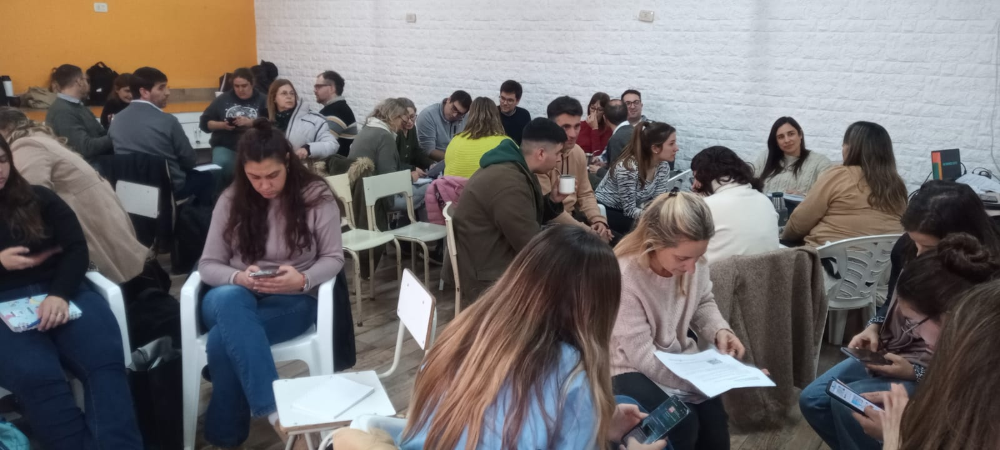
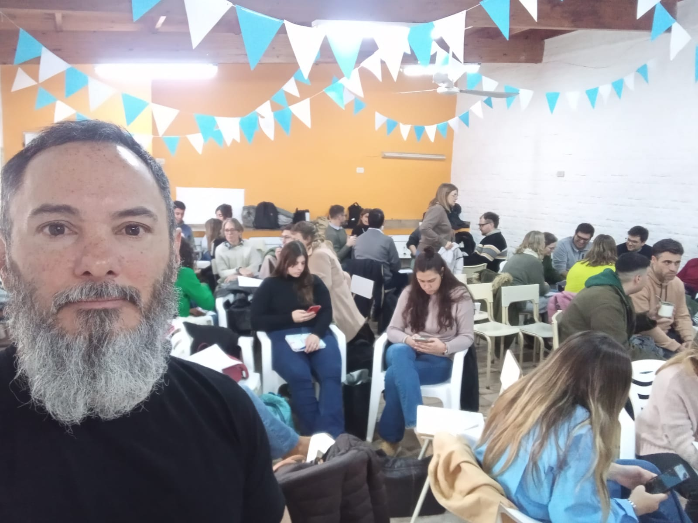
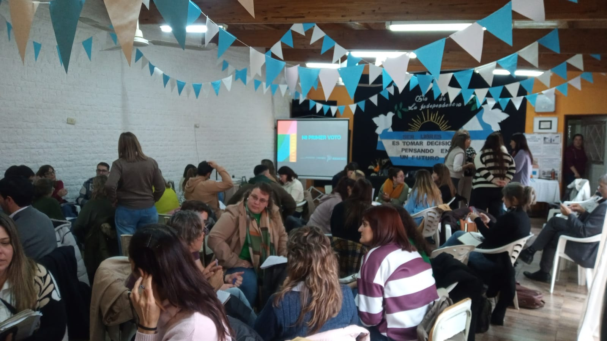
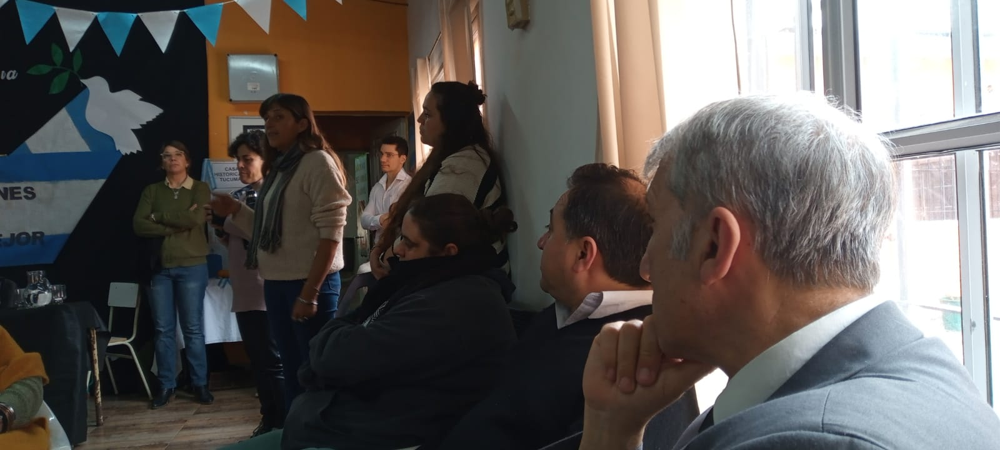
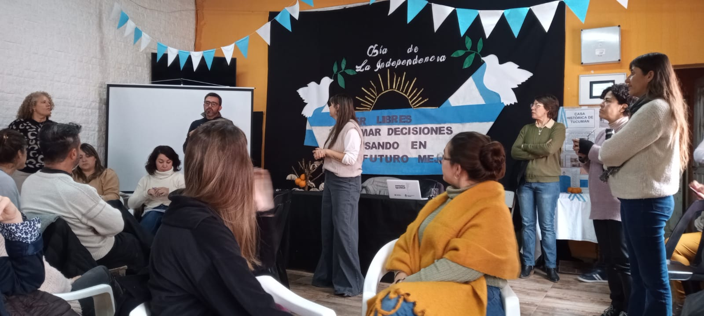
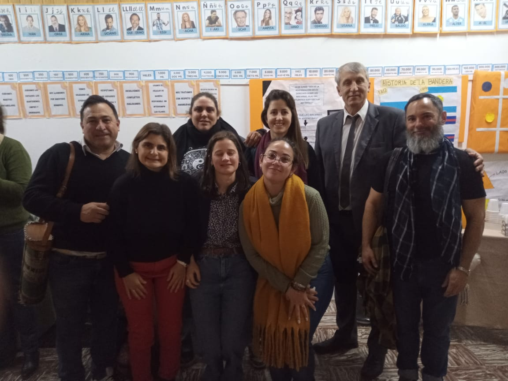

```{r setup, include=FALSE}
knitr::opts_chunk$set(echo = TRUE)
```

<style>
details > summary {
  background-color: #007BFF;
  color: white;
  padding: 10px;
  font-weight: bold;
  border: none;
  border-radius: 4px;
  cursor: pointer;
  margin-top: 10px;
}
details[open] > summary {
  background-color: #0056b3;
}
details details > summary {
  background-color: #28a745;
  color: white;
  margin-top: 8px;
}
details details[open] > summary {
  background-color: #1e7e34;
}
</style>

<style>
details > summary {
  background-color: #007BFF;
  color: white;
  padding: 10px;
  font-weight: bold;
  border: none;
  border-radius: 4px;
  cursor: pointer;
  margin-top: 10px;
}
details[open] > summary {
  background-color: #0056b3;
}
</style>

<style>
p {
  text-align: justify;
  text-indent: 30px;
  margin-bottom: 20px;
  font-size: 16px;
  line-height: 1.6;
}
</style>

<!-- Encabezado con logo y título -->
<table style="width:100%; border-collapse:collapse;">
  <tr>
    <td style="width:80%; vertical-align:middle;">
      <h1 style="margin: 0;">Mi Primer Voto</h1>
      <h4 style="margin: 0;">Realizado por el Lic. Daniel D. Molina para la EES N°2 Rauch</h4>
      <p style="margin: 0;">12 de julio de 2025</p>
    </td>
    <td style="width:20%; text-align:right;">
      
    </td>
  </tr>
</table>

<div style="border: 1px solid #ccc; padding: 15px; border-radius: 5px; background-color: #f9f9f9; margin-bottom: 20px;">
  <p style="margin: 0 0 5px 0; text-indent: 30px;">
    La democracia es el gobierno de todos y para todos. No se limita a la participación en los procesos electorales, se construye colectiva y cotidianamente en distintas esferas de la vida social. El voto es un modo de participar en ella, de elegir el rumbo y la forma que queremos para nuestra Argentina.
  </p>
  <p style="margin: 0; font-weight: bold; text-align: right;">Prof. Alberto E. Sileoni</p>
</div>

## Mi primer voto 

<p style="text-indent: 30px; margin-bottom: 20px;">
<span style="font-weight: bold;">Por David Cela Heffel, Gastón De Luca y Sabrina Garbovetzky.</span> <br> Es un programa de formación política destinado a personas que viven en la provincia de Buenos Aires y emitirán su voto por primera vez.
El programa está pensado para informar, capacitar y formar a ciudadanos y ciudadanas de la provincia de Buenos Aires en aspectos políticos que se presentan en la vida democrática de la provincia de Buenos Aires. El mismo buscará propiciar la participación ciudadana en el ejercicio democrático.
El programa se estructura sobre las características del Estado y del Gobierno, el sistema democrático y sus formas de representación y participación, las características históricas y sociales del voto en la República Argentina y en particular en la Provincia de Buenos Aires y el ejercicio electoral en el día de los comicios.</p>

<details>
<summary><strong>Jornada</strong></summary>
<details>
<summary><strong>Presentación</strong></summary>
<p style="font-family: Verdana; font-size: 18px; color: black; text-indent: 30px; margin-bottom: 20px;">
El presente informe detalla los contenidos y alcances de la Capacitación Mi Primer Voto del día 11 de julio de 2025 en la ciudad de San Miguel del Monte.
</p>
</details>

<details>
<summary><strong>Introducción</strong></summary>
<p style="text-indent: 30px; margin-bottom: 20px;">
El día 11 de julio se llevó a cabo la Capacitación Mi Primer Voto, con el objeto de brindar a los docentes de la región herramientas para desarrollar propuestas que permitan a nuestras y nuestros estudiantes formarse como ciudadanos comprometidos con los valores democráticos a partir del ejercicio del sufragio. Reconociendo que este no es el único vínculo entre ciudadanía y ejercicio político, y mucho menos con el significado de democracia en sentido amplio.
</p>
</details>

<details>
<summary><strong>Detalle de la jornada</strong></summary>
<p style="text-indent: 30px; margin-bottom: 20px;">
El encuentro fue planteado como taller, en el cual los docentes presentes realizamos algunos ejercicios con el objetivo de reconocer algunos aspectos cruciales que deben ser considerados a la hora de diseñar proyectos para el aula referidos a este tema.
</p>
</details>

<details>
<summary><strong>Acciones</strong></summary>
<p style="text-indent: 30px; margin-bottom: 20px;">
El encuentro comenzó con un ejercicio que ponía de relieve la importancia de las redes sociales en la participación política de los jóvenes de 16 y 17 años. Luego, se revisaron algunos atributos del sistema electoral bonaerense (cronogramas, desdoblamiento, renovación parcial, etc.), lo cual también se realizó más tarde con el sistema electoral nacional. Según las capacitadoras, corresponde un alto porcentaje de participación electoral a los jóvenes. Por último, se propuso armar grupos por distrito escolar para coordinar acciones en conjunto.</p>
<p style="text-indent: 30px; margin-bottom: 20px;">
📄 Descargar documento trabajado en la jornada:<br>
<a href="Materiales/Consignas.pdf" target="_blank">Ver documento (PDF)</a>

</details>

<details>
<summary><strong>Conclusiones</strong></summary>
<p style="text-indent: 30px; margin-bottom: 20px;">
A diferencia de la capacitación realizada en el año 2023, esta nueva edición no contó con la presencia de expertos, como la Mg. en Estudios Electorales Sabrina Garbovetzky, ni los datos e información necesarios para el respaldo de lo trabajado. Faltó además, la mirada de expertos en elecciones y sistemas electorales. A pesar de lo mencionado, los y las docentes de Rauch pudimos coincidir en la elaboración de material audiovisual de manera compartida y colaborativa y en la posible realización de un encuentro entre estudiantes y candidatos</p>
</details>

```{=html}
<details>
  <summary><strong>Imágenes</strong></summary>
  <div style="display: flex; flex-wrap: wrap; gap: 10px;">
    
    
    
    
    
    
    
  </div>
</details>
```

</details>

<details>
<summary><strong>Normativa</strong></summary>

<details>
<summary><strong>Ley de Educación Nacional N.º 26.206 </strong></summary>
<p style="text-indent: 30px; margin-bottom: 20px;">
•	Artículo 3°: Establece que la educación debe formar ciudadanos responsables, con sentido crítico, comprometidos con los valores democráticos y la participación ciudadana.
•	Artículo 11° inciso i): Define entre los fines y objetivos de la política educativa nacional el desarrollo de una cultura política democrática y el ejercicio de la ciudadanía.
•	Artículo 27°: En la educación secundaria, se garantiza la formación ética y ciudadana de los estudiantes, preparándolos para participar activa y responsablemente en la vida social y política.
<a href="https://www.argentina.gob.ar/sites/default/files/ley-de-educ-nac-58ac89392ea4c.pdf">Ver texto completo</a>
</p>
</details>

<details>
<summary><strong>Diseños Curriculares</strong></summary>
<p style="text-indent: 30px; margin-bottom: 20px;">
(Resolución 659/06 y documentos curriculares posteriores)
•	En el área de Formación Ética y Ciudadana, establece como propósito central el desarrollo de competencias para comprender el funcionamiento del sistema democrático y participar activamente en él.
•	Propicia el debate como estrategia pedagógica para fomentar el pensamiento crítico y la argumentación.
•	Estimula el análisis de situaciones sociales, la elaboración de juicios propios y el respeto por la diversidad.
<a href="http://servicios2.abc.gov.ar/recursoseducativos/editorial/catalogodepublicaciones/diseno_curricular.html">Ver textos completos</a>
</p>
</details>

<details>
<summary><strong>Ley de educación de la Provincia de Buenos Aires-13688</strong></summary>La Ley 13.688 es la Ley de Educación Provincial de la Provincia de Buenos Aires. Esta ley establece el marco normativo para el ejercicio del derecho a la educación en la provincia, garantizando el acceso, la igualdad de oportunidades y la calidad educativa para todos los habitantes, de acuerdo con la Constitución Nacional y Provincial, y la Ley de Educación Nacional. 
<br> <span style="font-weight: bold;">Principales aspectos de la Ley 13.688:</span>
<br> <span style="font-weight: bold;">Marco Legal:</span>
    La ley se basa en los principios establecidos en la Constitución Nacional y Provincial, así como en los tratados internacionales incorporados a ellas, y en la Ley de Educación Nacional. 
<br> <span style="font-weight: bold;">Derecho a la Educación:</span>
La ley garantiza el derecho a la educación para todos los habitantes de la provincia, sin discriminación, y establece las bases para la organización y funcionamiento del sistema educativo provincial. 
<br> <span style="font-weight: bold;">Sistema Educativo Provincial:</span>
Define la estructura del sistema educativo, incluyendo los diferentes niveles (inicial, primario, secundario, superior) y modalidades (educación especial, técnico-profesional, artística, etc.). 
<br> <span style="font-weight: bold;">Gestión Estatal y Privada:</span>
La ley abarca tanto a las instituciones educativas de gestión estatal como a las de gestión privada, asegurando la regulación y supervisión de ambas. 
<br> <span style="font-weight: bold;">Financiamiento</span>
Establece los mecanismos para el financiamiento del sistema educativo, garantizando los recursos necesarios para su sostenimiento y desarrollo. 
<br> <span style="font-weight: bold;">Participación:</span>
Promueve la participación de la comunidad educativa (docentes, estudiantes, familias, organizaciones sociales) en la elaboración y seguimiento de las políticas educativas. 
<br> <span style="font-weight: bold;">Inclusión:</span>
La ley contempla la inclusión de diferentes grupos poblacionales con necesidades educativas específicas, como personas con discapacidad, adultos mayores, personas privadas de la libertad, y personas con enfermedades, a través de modalidades como la educación especial, domiciliaria y hospitalaria, y la educación en contextos de encierro.
<br> <span style="font-weight: bold;">Formación Ciudadana y para el Trabajo:</span>
La ley busca formar ciudadanos comprometidos con la democracia, el respeto a los derechos humanos y la participación social, así como también preparar a los estudiantes para el mundo del trabajo y la producción. 
<br> <span style="font-weight: bold;">Articulación con otros Niveles y Modalidades:</span>
La ley promueve la articulación entre los diferentes niveles y modalidades del sistema educativo, así como con otros ámbitos como el trabajo y la producción, para asegurar una formación integral de los estudiantes. 
<br> <span style="font-weight: bold;">Evaluación y mejora continua:</span>
La ley establece mecanismos para la evaluación del sistema educativo y la implementación de políticas orientadas a la mejora continua de la calidad educativa. 
<br> <span style="font-weight: bold;">En resumen,</span> <br>la Ley 13.688 es una herramienta fundamental para garantizar el derecho a la educación en la provincia de Buenos Aires, estableciendo un marco legal que promueve la inclusión, la calidad y la participación en el ámbito educativo. 
<p style="text-indent: 30px; margin-bottom: 20px;">
<a href="https://normas.gba.gob.ar/ar-b/ley/2007/13688/3181">Ver texto completo</a>
</p>
</details>

<details>
<summary><strong>Ley 5109</strong></summary>
<p style="text-indent: 30px; margin-bottom: 20px;">
La Ley 5.109, también conocida como "Ley Electoral" de la provincia de Buenos Aires, establece el régimen de elecciones primarias, abiertas, obligatorias y simultáneas para la selección de candidatos a cargos públicos electivos. Además, la ley regula aspectos como el funcionamiento de las mesas electorales, el escrutinio de votos, y las sanciones por incumplimiento de plazos electorales. 
<br> <span style="font-weight: bold;">Aspectos clave de la Ley:</span>
<br> <span style="font-weight: bold;">Funcionamiento de Mesas Electorales:</span>
La ley detalla cómo deben instalarse y operar las mesas receptoras de votos, así como los procedimientos para el escrutinio de los votos. 
<br> <span style="font-weight: bold;">Escrutinio de Votos:</span>
Se establecen mecanismos para el escrutinio provisorio y definitivo, incluyendo la forma de resolver diferencias en el conteo de votos. 
<br> <span style="font-weight: bold;">Sanciones:</span>
La ley prevé multas para partidos políticos y ciudadanos que incumplan los plazos electorales o difundan propaganda fuera de los plazos permitidos. 
<br> <span style="font-weight: bold;">Voto de extranjeros:</span>
La ley contempla el derecho al voto de extranjeros en determinadas circunstancias y para ciertos cargos electivos. 
<br> <span style="font-weight: bold;">Modificaciones:</span>
La ley ha sido modificada en varias ocasiones para ajustar plazos, incorporar nuevas tecnologías (como el voto electrónico), y reglamentar el funcionamiento de las elecciones. 
<br> <span style="font-weight: bold;">En resumen,</span> <br>la Ley 5.109 es la columna vertebral del sistema electoral de la provincia de Buenos Aires, garantizando un proceso electoral transparente y democrático.<a href="https://normas.gba.gob.ar/documentos/VGW7pIWV.html">Ver documento</a>
</p>
</details>

<details>
<summary><strong>Ley 14086 de Elecciones Primarias</strong></summary>
<p style="text-indent: 30px; margin-bottom: 20px;">Texto Actualizado con las modificaciones introducidas por Ley 14249, 14470 y 14848.<a href="https://www.juntaelectoral.gba.gov.ar/docs/Ley_14086.pdf">Ver documento</a>
</p>
</details>

<details>
<summary><strong>Ley 14.848 “Paridad de género en las candidaturas”</strong></summary>
<p style="text-indent: 30px; margin-bottom: 20px;">La Ley 14.848, conocida como la Ley de Paridad de Género en las Candidaturas, establece la obligatoriedad de la participación equitativa entre géneros (50% mujeres y 50% hombres) en las listas de candidatos para cargos públicos electivos en la Provincia de Buenos Aires. Esta ley busca garantizar la igualdad de oportunidades y la representación de ambos géneros en la esfera política. 
<br> <span style="font-weight: bold;">Alcances:</span>
    La ley se aplica a todos los cargos públicos electivos de la provincia, incluyendo diputados, senadores, concejales, intendentes, entre otros.
    <br>La paridad debe respetarse tanto en las fórmulas de candidatos como en las listas de suplentes.
    <br>La ley busca corregir la histórica subrepresentación de las mujeres en la política y promover una participación más equitativa. 
<br> <span style="font-weight: bold;">Contexto y antecedentes:</span>
La ley fue promulgada el 19 de octubre de 2016 y publicada el 26 de octubre de 2016. 
<br>La Ley 14.848 se enmarca en un contexto de leyes y políticas públicas destinadas a promover la igualdad de género en diferentes ámbitos, incluyendo el político. 
<br>En la Provincia de Buenos Aires, también existen otras leyes y medidas que buscan fortalecer la perspectiva de género en el ámbito público, como la Ley 11.097 que creó el Consejo Provincial de la Mujer y la conformación del Ministerio de la Mujer. 
<br>A nivel nacional, la Ley Micaela (Ley 27.499) establece la capacitación obligatoria en género para todos los empleados del Estado, incluyendo los tres poderes. 
<br> <span style="font-weight: bold;">Implementación y desafíos:</span>
  <br>La implementación de la Ley de Paridad de Género ha implicado un cambio en la forma de confeccionar las listas electorales, garantizando que se respete el principio de paridad. 
<br>Se han observado desafíos en la implementación, como la necesidad de asegurar que la paridad se concrete en todos los niveles y cargos.
<br>La capacitación en género, como la establecida por la Ley Micaela, es fundamental para acompañar la implementación de la paridad y promover una cultura organizacional más inclusiva. 
<a href="https://www.argentina.gob.ar/sites/default/files/participacion_politica_de_las_mujeres._hacia_una_democracia_paritaria.pdf">Ver documento</a>
</p>
</details>

<details>
<summary><strong>Ley 8871 - SáenzPeña</strong></summary>
<p style="text-indent: 30px; margin-bottom: 20px;">
La Ley Sáenz Peña, también conocida como Ley 8.871, fue una reforma electoral argentina sancionada en 1912 que estableció el voto universal, secreto y obligatorio para los hombres mayores de 18 años. <br>Esta ley fue un hito en la historia política del país, marcando un avance hacia la democratización del sistema electoral y la participación ciudadana. 
<br> <span style="font-weight: bold;">Características principales:</span>
<br> <span style="font-weight: bold;">Voto Universal -masculino-:</span>
    <br>A diferencia del sistema previo, permitía votar a todos los hombres mayores de 18 años, nativos o naturalizados, sin restricciones de clase o propiedad. 
<br> <span style="font-weight: bold;">Voto secreto:</span>
<br>Se implementó el cuarto oscuro y la boleta única para garantizar la privacidad del voto y evitar la coacción. 
<br> <span style="font-weight: bold;">Voto obligatorio:</span>
<br>Se establecía la obligación de votar para todos los ciudadanos varones comprendidos en el padrón electoral, con algunas excepciones como mayores de 70 años. 
<br> <span style="font-weight: bold;">Lista completa:</span>
<br>El sistema electoral se basaba en el sistema de lista incompleta, donde el partido más votado obtenía dos tercios de los cargos y el segundo, un tercio. 
<br> <span style="font-weight: bold;">Importancia:</span>
<br> <span style="font-weight: bold;">Fin del Fraude electoral:</span>
<br>La ley buscaba eliminar el fraude y la manipulación electoral que caracterizaban al sistema anterior. 
<br> <span style="font-weight: bold;">Mayor participación ciudadana:</span>
<br>Al hacer el voto obligatorio, se buscaba aumentar la participación de los ciudadanos en la vida política del país. 
<br> <span style="font-weight: bold;">Avance democrático:</span>
<br>La ley representó un paso importante en la construcción de un sistema político más democrático en Argentina, aunque con limitaciones como la exclusión del voto femenino. 
<br> <span style="font-weight: bold;">Contexto histórico:</span>
<br>La Ley Sáenz Peña fue impulsada por el entonces presidente Roque Sáenz Peña y sancionada durante su gobierno. La ley se promulgó en un contexto de creciente demanda de participación política por parte de diversos sectores de la sociedad argentina, especialmente la Unión Cívica Radical.<a href="https://www.argentina.gob.ar/normativa/nacional/ley-8871-310143">Ver documento</a>
</p>
</details> 

<details>
<summary><strong>Ley 13010 -Voto Femenino-</strong></summary>
<p style="text-indent: 30px; margin-bottom: 20px;">
<br>La Ley 13.010, conocida como la "Ley de voto femenino" en Argentina, fue sancionada el 23 de septiembre de 1947. Esta ley otorgó a las mujeres argentinas los mismos derechos políticos que a los hombres, permitiéndoles votar y ser elegidas en cargos públicos. 
Antecedentes y Sanción:
<br>La Ley Sáenz Peña de 1912 estableció el voto secreto y obligatorio solo para los hombres mayores de 18 años. 
<br>La lucha por el voto femenino fue liderada por figuras como Julieta Lanteri y Alicia Moreau de Justo, quienes impulsaron la inclusión de las mujeres en la vida política. 
<br>Sin embargo,el proyecto de ley fue impulsado por Eva Perón, quien lideró una campaña para que las mujeres obtuvieran sus derechos políticos. 
<br>La ley fue sancionada por el Congreso Nacional en 1947, después de ser aprobada por ambas cámaras. 
<br> <span style="font-weight: bold;">Implicancias y consecuencias:</span>
<br>La Ley 13.010 marcó un hito en la historia argentina, garantizando la igualdad de derechos políticos entre hombres y mujeres. 
<br>En las elecciones presidenciales de 1951, las mujeres votaron por primera vez en Argentina, representando un porcentaje significativo del electorado. 
<br>La ley también impulsó la creación del primer padrón electoral femenino y la participación de las mujeres en la vida política del país. 
<br>A pesar de la ley, las mujeres enfrentaron obstáculos para alcanzar cargos públicos, pero con el tiempo, la participación femenina en la política argentina ha ido aumentando. 
<br>En resumen, la Ley 13.010 fue un paso fundamental para la igualdad de género en Argentina, otorgando a las mujeres el derecho al voto y abriendo camino a su participación en la vida política del país. 
<a href="https://www.electoral.gob.ar/nuevo_legislacion/pdf/13010.pdf">Ver documento</a>
</p>
</details> 

<details>
<summary><strong>Ley 27412 Paridad de género en ámbitos de representación política</strong></summary>
<p style="text-indent: 30px; margin-bottom: 20px;">
<br>La Ley 27.412, también conocida como la Ley de Paridad de Género en Ámbitos de Representación Política, es una ley argentina que busca garantizar la igualdad de género en la representación política. Se introdujo en 2017 y modificó el Código Electoral Nacional, estableciendo la obligatoriedad de intercalar mujeres y hombres en las listas de candidatos para elecciones legislativas nacionales y cargos partidarios. 
<br> <span style="font-weight: bold;">Principales puntos:</span>
<br> <span style="font-weight: bold;">Paridad en las listas electorales:</span>
<br>La ley exige que las listas de candidatos para elecciones de diputados, senadores nacionales y parlamentarios del Mercosur se compongan de manera intercalada de mujeres y hombres, desde el primer titular hasta el último suplente. 
<br> <span style="font-weight: bold;">Sustituciones:</span>
<br>En caso de vacancia, las sustituciones deben ser realizadas por personas del mismo género que el titular original, siguiendo el orden de la lista. 
<br> <span style="font-weight: bold;">Paridad en cargos partidarios:</span>
<br>La ley también establece que los partidos políticos deben garantizar la paridad de género en el acceso a cargos partidarios en sus cartas orgánicas. 
<br> <span style="font-weight: bold;">Sanciones por incumplimiento:</span>
<br>La ley prevé la caducidad de la personería política de los partidos que incumplan con la paridad en la conformación de sus listas o en sus órganos partidarios. 
<br> <span style="font-weight: bold;">Modificaciones del Código Electoral Nacional:</span>
<br>La ley modifica el artículo 60 bis del Código Electoral Nacional, estableciendo los requisitos para la oficialización de las listas de candidatos. 
<br> <span style="font-weight: bold;">Impacto:</span>
<br>La Ley 27.412 ha tenido un impacto significativo en la representación femenina en el Congreso Nacional. Después de su implementación, la proporción de mujeres en la Cámara de Diputados aumentó del 33% al 50% en las elecciones de 2019. Sin embargo, aún existen desafíos para lograr la igualdad de género en la representación política, especialmente en el Senado, donde la proporción de mujeres es menor. 
<br> <span style="font-weight: bold;">Importancia:</span>
<br>La Ley de Paridad de Género es un paso importante hacia la igualdad de género en la política argentina. Al garantizar la participación equitativa de mujeres y hombres en la toma de decisiones, se busca construir una sociedad más justa e igualitaria. La ley también contribuye a ampliar la agenda pública para incluir temas relacionados con género y diversidad, y a aportar nuevos enfoques a la construcción política. 
<a href="https://servicios.infoleg.gob.ar/infolegInternet/anexos/300000-304999/304794/norma.htm">Ver documento</a>
</p>
</details>

<details>
<summary><strong>Ley 26774 Voto Joven</strong></summary>
<p style="text-indent: 30px; margin-bottom: 20px;">
<br>El 31 octubre de 2012 se sancionó la Ley de Ciudadanía Argentina número 26.774, conocida como “Ley de Voto Joven”, que establece el
derecho de los, las y les jóvenes de 16 y 17 años a participar en elecciones y elegir a sus representantes.
<br>En América Latina y el Caribe, la generación juvenil actual es la más grande en la historia, representando un 43% de la población y alrededor del 25% de los electorados. Sin embargo, sólo cinco países permiten el voto a los 16 y 17 años: Argentina, Brasil, Cuba, Ecuador y Nicaragua.
<br>La sanción de esta ley implicó una ampliación de derechos a las juventudes que habían iniciado desde comienzos de siglo un fuerte proceso de incorporación a las militancias políticas para la transformación social. El voto es la herramienta popular más relevante, que implica expresarse en las urnas y decidir el rumbo del país. Por lo tanto, resulta indispensable a los efectos del fortalecimiento de la democracia trabajar en garantizar este derecho a todos y todas. 
<a href="https://www.argentina.gob.ar/sites/default/files/voto_joven_6.7.pdf">Ver documento</a>
</p>
</details>

</details>

<details>
<summary><strong>Materiales</strong></summary>

<details>
<summary><strong>Mi Primer Voto</strong></summary>
<p style="text-indent: 30px; margin-bottom: 20px;">
Cuadernillo con los contenidos trabajados en 2023.
<a href="Materiales/mi-primer-voto-cuadernillo-continuemos-estudiando-2.pdf" target="_blank">Ver documento (PDF)</a> <br>
<p style="text-indent: 30px; margin-bottom: 20px;">
Cuadernillo Julio 2025.
<a href="Materiales/MI PRIMER VOTO - Cuadernillo Versión Preliminar - julio 2025.pdf" target="_blank">Ver documento (PDF)</a> <br>
<p style="text-indent: 30px; margin-bottom: 20px;">
Cuadernillo 2025.
<a href="Materiales/MI PRIMER VOTO - Presentación 2025.pdf" target="_blank">Ver documento (PDF)</a> <br>
<p style="text-indent: 30px; margin-bottom: 20px;">
Datos electorales.
<a href="Materiales/DATOS ELECTORALES - Elecciones PBA MPV.pdf" target="_blank">Ver documento (PDF)</a> <br>
<p style="text-indent: 30px; margin-bottom: 20px;">
Juego Didáctico Democracia en Pistas.
<a href="Materiales/Democracia en pistas - Link de descarga.pdf" target="_blank">Ver documento (PDF)</a>
</details>

<details>
<summary><strong>Material para Centros de Estudiantes</strong></summary>
<p style="text-indent: 30px; margin-bottom: 20px;">
Material informativo para los centros de estudiantes.
<a href="Materiales/Centros de Estudiantes - Guía hoja de ruta.pdf" target="_blank">Ver documento (PDF)</a>
</details>

<details>
<summary><strong>Programa Voto Joven</strong></summary>
<p style="text-indent: 30px; margin-bottom: 20px;">
📽Presentación del Programa Voto Joven en pdf.
<a href="Materiales/Voto a los 16.pptx.pdf" target="_blank">Ver documento (PDF)</a>
</details>

</details>


